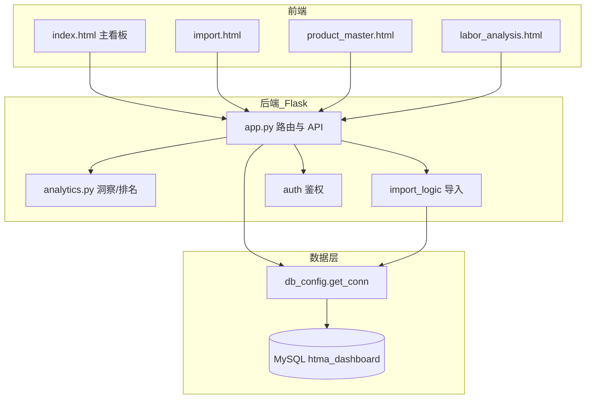
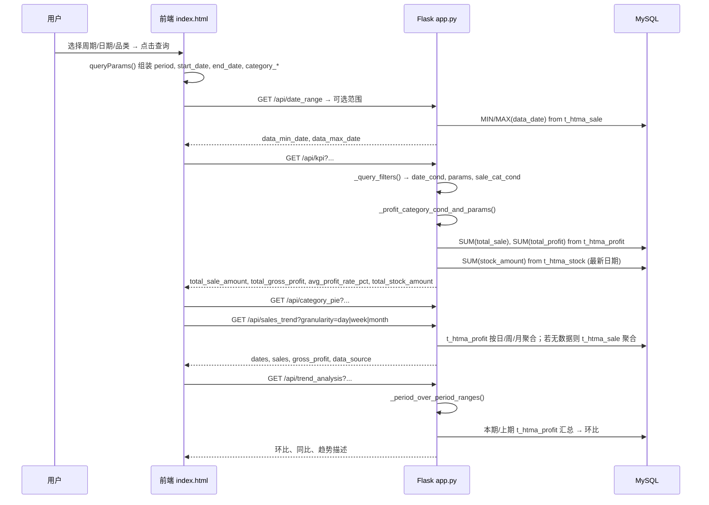

# 好特卖运营看板 · 项目重构与优化方案

本文档基于对当前代码库的系统性扫描，给出**项目现状分析**、**业务逻辑梳理**、**可复用功能识别与封装设计**、**性能优化建议**及**实施路线图**。

---

## 1. 项目现状分析

### 1.1 代码结构概览

```
hotmaxxflag/
├── htma_dashboard/           # 看板应用（Flask 单体）
│   ├── app.py                # 主应用：路由、API、业务逻辑（约 7043 行）
│   ├── analytics.py          # 零售分析模型：洞察、品类排名等（约 1200+ 行）
│   ├── auth.py               # 飞书登录、权限
│   ├── db_config.py          # MySQL 配置与 get_conn()
│   ├── feishu_util.py        # 飞书通知
│   ├── import_logic.py       # Excel 导入：销售/库存/毛利/人力/商品档案等
│   ├── notify_util.py        # 通知工具
│   ├── price_compare.py      # 比价逻辑
│   └── static/               # 前端静态页
│       ├── index.html        # 主看板（约 3293 行）：多 Tab、KPI/图表/筛选/下钻
│       ├── import.html       # 数据导入
│       ├── login.html        # 登录
│       ├── product_master.html  # 商品档案分析 + 下钻
│       ├── labor_analysis.html  # 人力分析
│       ├── approval.html, pending.html
│       └── ...
├── scripts/                  # 建表、导入、校验、OpenClaw 等脚本
├── config/                   # OpenClaw 配置
└── docs/                     # 文档
```

### 1.2 模块划分图



### 1.3 主要功能模块与职责

| 模块 | 职责 | 主要 API / 入口 | 数据流向 |
|------|------|-----------------|----------|
| **销售概览** | KPI、品类饼图、趋势、环比、星期分布 | `/api/kpi`, `/api/category_pie`, `/api/daily_trend`, `/api/sales_trend`, `/api/trend_analysis`, `/api/dow_sales` | `t_htma_profit`（优先）→ 无数据时降级 `t_htma_sale`；库存用 `t_htma_stock` |
| **品类/排名** | 大类/中类/小类排名、贡献矩阵 | `/api/category_rank_mid`, `/api/category_rank_small`, `/api/category_rank`, `/api/category_rank_by_large` 等 | `t_htma_sale` / `t_htma_profit`，依赖 `_query_filters` |
| **消费洞察** | 概览 KPI、品类/品牌/价格带/经销/新品、走势图 | `/api/consumer_insight`, `/api/consumer_insight_trend` | `t_htma_sale`；走势固定总体（不传 category/brand） |
| **下钻分析** | 主看板：品类→品牌→明细；消费洞察：category/brand 下钻 | 同上 + `queryParams` 中 `category`/`brand` 仅消费洞察 Tab 传递 | 同上；商品档案下钻见下 |
| **商品档案** | 分店商品档案分析、品类→品牌→SKU 下钻 | `/api/product_master_analysis`, `/api/product_master_drill` | `t_htma_product_master` + `t_htma_sale`（近 30 天） |
| **经营分析** | 毛利/销售明细、库存预警、退货/赠送、品牌/供应商汇总 | `/api/profit_detail`, `/api/sale_detail`, `/api/inv_alert*`, `/api/return_gift_summary`, `/api/brand_summary` 等 | `t_htma_profit` / `t_htma_sale` / `t_htma_stock` |
| **数据导入** | Excel 上传、从下载目录导入、人力/商品档案导入 | `/api/import`, `/api/import_from_downloads`, `/api/import_labor_cost` 等 | 写入各 `t_htma_*` 表 |
| **人力成本** | 人力数据、分析、类目/岗位/映射管理 | `/api/labor_cost*`, `/api/labor_analysis/*` | 人力相关表 |
| **税率/比价/报表** | 税率汇总、比价、报表历史、AI 对话 | `/api/tax_burden_*`, `/api/price_compare*`, `/api/marketing_report` 等 | 对应表 |

### 1.4 重复或相似代码片段（位置与说明）

| 类型 | 出现位置 | 说明 |
|------|----------|------|
| **筛选条件解析** | `app.py`：`_query_filters()`、`_date_condition()`、`_profit_category_cond_and_params()` | 约 30+ 处 API 调用 `_query_filters()`，逻辑集中但各 API 自行拼 SQL，无统一查询封装。 |
| **日期/周期处理** | `app.py`：`_date_condition`、`_period_over_period_ranges` | 多处重复「自定义区间 vs period」判断与参数构造。 |
| **趋势 SQL 模板** | `app.py`：`api_sales_trend`（day/week/month 各一段）、`api_consumer_insight_trend`（day/week/month 各一段） | 按粒度分支的 SELECT + GROUP BY 高度相似；profit 表无数据再查 sale 表的降级在 `api_sales_trend` 中重复了两段（5142–5174 与 5143 后逻辑重复）。 |
| **ECharts 初始化与配置** | `index.html`：loadPie、loadBar、消费洞察内多处 `echarts.init` + `setOption`；`product_master.html`：6 个饼/柱状图 | 每个图表单独 init、类似 grid/tooltip 配置重复；无统一「趋势折线/柱状/饼图」组件。 |
| **KPI 卡片渲染** | `index.html`：loadKpi 内 4 卡片；消费洞察概览 KPI；`product_master.html`：renderKpi 多卡片 | 结构类似：label + value + 可选单位/样式，未抽象为可配置 KPI 组件。 |
| **前端 queryParams 与 fetch** | `index.html`：queryParams()、多处 `fetch(API + '/api/xxx?' + queryParams())` | 约 84 处 fetch/queryParams 相关；日期、品类、下钻参数分散在多处维护，易漏传或不一致。 |
| **品类/品牌下钻与 URL 同步** | `index.html`：消费洞察 `currentInsightCategory`/`currentInsightBrand`、syncInsightParamsFromUrl、面包屑式点击 | 下钻状态与 URL 的读写分散在多个函数；商品档案页另有独立下钻（品类→品牌→SKU）。 |
| **表格排序/分页** | `index.html`：品类排名、毛利明细、库存预警等 | 分页与排序逻辑按表格各自实现，可抽象为通用表格组件。 |
| **连接获取与关闭** | `app.py`：约 100 处 `get_conn()` / `conn.cursor()` / `conn.close()` | 无上下文管理器统一封装，部分分支存在未 close 风险（finally 已有但模式不统一）。 |

---

## 2. 业务逻辑梳理

### 2.1 销售分析流程（用户操作 → 数据返回）



### 2.2 下钻分析流程

- **主看板「经营分析」等**：仅品类级联（大类/中类/小类 + 商品）通过 `category_large_code` / `category_mid_code` / `category_small_code` 筛选，无「品类名 → 品牌」二级下钻。
- **消费洞察 Tab**：  
  - 用户点击品类/品牌行 → 更新 `currentInsightCategory` / `currentInsightBrand`，并同步到 URL（`category`、`brand`）。  
  - 再次请求 `/api/consumer_insight` 时带上 `category`、`brand`，后端 `_query_filters()` 生成 `sale_category_cond`，数据范围缩小到该品类/品牌。  
  - 切换回「概览」时清除下钻参数，避免污染其他 Tab。
- **商品档案页**：  
  - 点击品类行 → `/api/product_master_drill?category=xxx` → 返回该品类下品牌列表（含 SKU 数、销售）。  
  - 点击品牌行 → `/api/product_master_drill?category=xxx&brand=yyy` → 返回 SKU 销售明细（分页）。

### 2.3 数据依赖汇总

| 业务场景 | 主表 | 关键字段 / 聚合 | 备注 |
|----------|------|------------------|------|
| KPI（销售额/毛利/毛利率） | t_htma_profit | total_sale, total_profit；按 date_cond + category 筛选 | 库存来自 t_htma_stock 最新日 |
| 趋势（日/周/月） | t_htma_profit → 降级 t_htma_sale | 按日/周/月 GROUP BY，sale_amount + profit_amount | 降级时毛利用 gross_profit 或 sale_amount - sale_cost |
| 品类占比 / 排名 | t_htma_sale 或 t_htma_profit | category/category_large/mid/small，SUM(sale_amount) 等 | 不同 API 用不同 category 层级 |
| 消费洞察 | t_htma_sale | 概览：SUM(sale_amount), SUM(gross_profit)；品类/品牌/价格带/经销方式等 | 经销方式需 JOIN t_htma_product_master.distribution_mode |
| 商品档案下钻 | t_htma_product_master + t_htma_sale | 近 30 天 sale 汇总，按品类/品牌过滤 | 分页在 SKU 明细 |

### 2.4 当前实现中的问题与合理性

- **合理性**：  
  - 优先 profit 表、无数据再降级 sale 表，保证有趋势可看，逻辑合理。  
  - 消费洞察下钻仅在本 Tab 生效、不污染概览，设计正确。  
  - 日期/品类由 `_query_filters` 统一解析，减少参数不一致。
- **冗余/瓶颈**：  
  - 同一请求周期内，多个 API 各自 `get_conn()`、各自执行 1～N 条 SQL，无批量查询也无缓存，首屏会触发十几次请求。  
  - `api_sales_trend` 内「无数据时降级」代码块重复（5142–5174 与 5143 后一段重复）。  
  - 趋势按日/周/月三个分支写死，可抽象为「粒度 + 表选择」的单一查询构建器。

### 2.5 核心业务规则整理

| 规则 | 说明 | 实现位置 |
|------|------|----------|
| **毛利率** | 平均毛利率 = 总毛利 / 总销售额 × 100；单条可用 profit_rate 或计算 | app.py 多处；analytics.py |
| **KPI 周期** | 支持 今日/本周/本月/近30天/自定义；自定义时 start_date、end_date 同时传入，忽略 period | `_date_condition` |
| **环比周期** | 本期与上期等长；自定义区间时上期 = 本期前推相同天数 | `_period_over_period_ranges` |
| **下钻层级** | 主看板：大类→中类→小类→商品（编码）；消费洞察：品类名→品牌名；商品档案：品类→品牌→SKU | 前端 queryParams + 后端 category/brand 条件 |
| **趋势降级** | 优先 t_htma_profit 按日/周/月聚合；若结果为空则用 t_htma_sale 聚合（gross_profit 或 sale_amount - sale_cost） | `api_sales_trend` |
| **消费洞察走势** | 固定总体（不传 category/brand）；品类 Top5 为销售额占比前 5 的品类，按粒度算走势 | `api_consumer_insight_trend` |
| **return_amount** | 若 t_htma_sale 无 return_amount 列，则退货相关为 0，不报错 | `api_consumer_insight_trend` 内 information_schema 检查 |

---

## 3. 可复用功能识别与封装

### 3.1 通用数据查询层

- **目标**：统一筛选条件（日期、品类、品牌、SKU）、统一表选择与降级、可选缓存，减少各 API 内重复 SQL 与连接管理。
- **设计要点**：  
  - 输入：从 `request.args` 或显式传入的 `period/start_date/end_date`、`category_*`、`brand`、`sku_code` 等。  
  - 输出：标准化结构，如 `(date_cond, date_params, sale_cond, sale_params, profit_cond, profit_params)`，或进一步封装为「执行器」：给定指标（如 kpi、trend_day、trend_week）、返回已聚合结果。  
  - 降级：封装「先查 profit 表，若无数据再查 sale 表」为单一方法，供 KPI、趋势等复用。  
  - 缓存：对只读、周期/品类组合有限的接口（如 /api/date_range、按 period 的 KPI）可做短期内存缓存（如 60s）或 Redis，key 含 store_id + 参数哈希。
- **接口示例（Python）**：

```python
# 查询层接口示例（新建 htma_dashboard/query_layer.py）

class QueryFilters:
    """从 request 或显式参数解析出的筛选条件，只做解析不执行 SQL。"""
    def __init__(self, request=None, *, period=None, start_date=None, end_date=None,
                 category_large_code=None, category_mid_code=None, category_small_code=None,
                 category=None, brand=None, sku_code=None):
        ...
    def date_condition(self): ...
    def sale_category_condition(self): ...
    def profit_category_condition(self): ...

def execute_trend(granularity: str, filters: QueryFilters, store_id: str) -> dict:
    """优先 profit 表，无数据则从 sale 表聚合；返回 { dates, sales, gross_profit, data_source }。"""
    ...
```

- **需要修改的原有文件**：  
  - `app.py`：逐步将 `_query_filters`、`_date_condition`、`_profit_category_cond_and_params` 改为调用 `QueryFilters`；将 `api_sales_trend`、`api_kpi` 等改为调用 `execute_trend`、`execute_kpi` 等封装。  
  - 保持现有 API 路径与 JSON 结构不变，仅内部实现替换。

### 3.2 通用筛选器组件（前端）

- **目标**：日期范围、品类树（大类/中类/小类）、品牌下拉、可选「下钻」维度（如消费洞察的 category/brand）统一为组件，状态与 URL 同步。
- **设计要点**：  
  - 输入：配置项（是否显示品类级联、是否显示下钻、默认 period、date_range 的 min/max）。  
  - 输出：DOM 片段 + 内部状态；提供 `getQueryParams()`、`onChange(callback)`，便于主页面统一在「查询」时组装参数。  
  - URL 同步：读取 `?start_date=&end_date=&period=&category=&brand=` 初始化；变更时写回 `history.replaceState` 或 `pushState`。
- **接口示例（前端）**：

```javascript
// 通用筛选器组件（可放在 static/js/filter-bar.js 或内联在 index 中先抽成函数）

function createFilterBar(options) {
  const { showCategoryCascade = true, showDrillParams = false, defaultPeriod = 'recent30' } = options || {};
  // 返回：{ el, getQueryParams(), setFromUrl(), onApply(cb) }
}
```

- **需要修改的原有文件**：  
  - `index.html`：将「筛选栏」DOM 与 `currentPeriod`、`currentStartDate`、`currentEndDate`、`currentCategoryLargeCode` 等收敛到 `createFilterBar` 的 get/set；`queryParams()` 改为优先从筛选器组件取值。  
  - `labor_analysis.html`：若有类似筛选，可复用同一组件或同一接口约定。

### 3.3 通用图表组件（前端）

- **目标**：趋势图（折线/柱状）、贡献矩阵（气泡/表格）、分布图（饼图/环形图）封装为可配置组件，统一 ECharts init/ resize/ dispose，统一数据格式。
- **设计要点**：  
  - 趋势图：输入 `{ labels, series: [{ name, data, type?: 'line'|'bar' }] }`，可选双 Y 轴、单位。  
  - 饼图/环形图：输入 `[{ name, value }, ...]`，可选 radius、color。  
  - 贡献矩阵：输入二维数据 + 行列名，输出表格或气泡图。  
  - 所有图表：容器 id、resize 监听、主题（与现有深色一致）由组件内部处理。
- **接口示例**：

```javascript
// 示例：趋势图
function createTrendChart(containerId, options) {
  // options: { labels, series: [{ name, data, unit }], dualAxis?: boolean }
  // 返回：{ update(data), resize(), destroy() }
}
```

- **需要修改的原有文件**：  
  - `index.html`：loadPie、loadBar、消费洞察内多图、loadTrendAnalysis 等改为调用上述组件，数据格式由各 load 函数适配为组件入参。  
  - `product_master.html`：6 个图改为通用饼图/柱状图组件。

### 3.4 通用下钻逻辑与面包屑

- **目标**：下钻状态（当前层级、category/brand 等）集中管理；与 URL 双向同步；提供面包屑 DOM 与「返回上一级」行为。
- **设计要点**：  
  - 状态：`{ level, category?, brand?, ... }`，仅消费洞察 Tab 使用 category/brand；商品档案为独立流程（品类→品牌→SKU）。  
  - URL：读 `category`、`brand` 初始化；点击下钻时更新 state 并 `replaceState`。  
  - 面包屑：根据 level 渲染「概览 > 品类名 > 品牌名」，点击某级清空其后层级并刷新数据。
- **需要修改的原有文件**：  
  - `index.html`：`currentInsightCategory`/`currentInsightBrand`、`syncInsightParamsFromUrl`、消费洞察表格点击逻辑改为调用统一下钻状态 + 面包屑组件。

### 3.5 通用 KPI 卡片

- **目标**：传入指标数组（label、value、unit、style），自动排版为网格卡片。
- **设计要点**：  
  - 输入：`[{ id, label, value, unit?, format?: 'number'|'money'|'percent', warnThreshold?, dangerThreshold? }]`。  
  - 输出：一段 HTML 或 DOM；value 的格式化（万、小数位、颜色）由组件内部根据 format 与阈值处理。
- **需要修改的原有文件**：  
  - `index.html`：主看板 4 KPI、消费洞察概览 KPI 改为传入数组调用 KPI 组件。  
  - `product_master.html`：renderKpi 改为使用同一 KPI 组件。

### 3.6 预期收益

- **通用查询层**：减少 20+ 处重复 SQL 与连接逻辑；新增「按周期/品类」的 API 时只需调封装，降低遗漏降级或条件不一致的风险。  
- **通用筛选器**：日期/品类/下钻参数一处维护，与 URL 一致，减少漏传或错传。  
- **通用图表**：ECharts 初始化与配置集中，后续改主题或交互只改组件；减少 index 与 product_master 中重复图代码。  
- **通用下钻与 KPI**：新 Tab 或新页复用同一套下钻与 KPI 展示，开发效率与体验一致。

---

## 4. 性能优化建议

### 4.1 API 响应与数据库

- **现状**：  
  - 无 Redis/内存缓存；每次请求均查 MySQL。  
  - 单页加载触发十余个 API，各 API 独立 `get_conn()`，存在大量短连接或连接复用依赖 Flask 请求生命周期。  
  - 部分接口存在「先查 information_schema 再写 SQL」的运行时列检查（如 return_amount），可改为启动时或迁移时一次性检测并配置。
- **建议**：  
  1. **预聚合表**：对「按日/周/月」的销售与毛利汇总，可增加日汇总表（如 `t_htma_sale_daily_summary`、`t_htma_profit_daily_summary`），由定时任务或导入后触发更新；趋势与 KPI 优先查汇总表，减少大表扫描。  
  2. **缓存**：  
     - `/api/date_range`、按 `period`（非 custom）的 `/api/kpi` 等可缓存 60s（内存或 Redis），key 含 store_id。  
     - 品类树（大类/中类/小类选项）变化不频繁，可缓存 5–10 分钟。  
  3. **N+1**：当前未发现典型 N+1（如循环内按 ID 查详情）；消费洞察趋势中「品类 Top5 走势」对每个品类单独一条 SQL，可合并为一条带品类条件的聚合或先用 Top5 列表再一次批量查询。  
  4. **连接管理**：使用 `with get_conn() as conn` 或 Flask 请求级连接池，确保每个请求内复用同一连接、请求结束关闭，避免泄漏。

### 4.2 前端

- **懒加载 / 分页**：  
  - 主看板多个 Tab：可改为「首次切换到该 Tab 再加载对应 API」，减少首屏请求数。  
  - 毛利明细、库存预警、品类排名等已分页的保持分页；未分页的大列表（如部分导出或下拉选项）可改为分页或虚拟滚动。  
- **请求合并**：若保持当前「多接口并行」方式，可考虑后端提供「看板聚合接口」（如一次返回 kpi + category_pie + trend 的摘要），前端首屏只调 1 次，再按需刷新单块。

### 4.3 具体步骤与预期效果

| 步骤 | 内容 | 预期效果 |
|------|------|----------|
| 1 | 增加日汇总表 + 定时/导入后更新 | 趋势与 KPI 查询从大表扫描改为小表扫描，响应时间明显下降 |
| 2 | 对 date_range、kpi（非 custom）做 60s 缓存 | 重复切换周期时接口命中缓存，降低 DB 压力 |
| 3 | 消费洞察趋势「品类 Top5」合并为 1～2 条 SQL | 减少 DB 往返次数 |
| 4 | 前端 Tab 懒加载 | 首屏请求数减半左右，首屏更快 |
| 5 | 可选：看板聚合接口 | 首屏 1 个请求替代多个，进一步缩短首屏时间 |

---

## 5. 输出与实施路线图

### 5.1 关键代码示例（框架）

已在仓库中新增 **`htma_dashboard/query_layer.py`**，提供：

- `date_condition(period, start_date, end_date)`：与现有 `_date_condition` 行为一致，返回 `(date_cond, params)`。
- `parse_period_from_request()`：从当前请求解析 `period/start_date/end_date`。
- `query_filters_from_request(include_sku=False)`：从 `request.args` 解析，返回与 `_query_filters` 相同的五元组；`params` 中 store_id 为占位 `None`，调用方需填入 `STORE_ID`。

**原有文件修改方式**：在 `app.py` 中先 `from query_layer import date_condition, query_filters_from_request`，将 `_date_condition` 改为调用 `date_condition`，将 `_query_filters` 改为调用 `query_filters_from_request`（并在传入 params 时把第一项设为 `STORE_ID`），保证返回格式不变；再逐步把「趋势/KPI」改为调用封装好的 `execute_trend`/`execute_kpi`。

**另**：`api_sales_trend` 中重复的「无数据时从销售表降级」代码块已删除，仅保留一次降级逻辑与空结果返回。

### 5.2 需要修改的原有文件汇总

| 文件 | 修改方向 |
|------|----------|
| `htma_dashboard/app.py` | 引入 query_layer；抽离趋势降级为单一函数；统一连接使用方式；可选缓存与日汇总表查询 |
| `htma_dashboard/static/index.html` | 筛选器组件化；queryParams 从组件取；图表组件化；下钻状态与面包屑组件；KPI 组件化；Tab 懒加载 |
| `htma_dashboard/static/product_master.html` | KPI 与图表改为调用通用组件（或共用 script） |
| `htma_dashboard/static/labor_analysis.html` | 若有日期/品类筛选，与主看板共用筛选器约定 |
| 新建 | `htma_dashboard/query_layer.py`；可选 `static/js/filter-bar.js`、`charts.js`、`kpi-cards.js` |

### 5.3 实施路线图（按优先级）

| 阶段 | 内容 | 优先级 |
|------|------|--------|
| **一** | 新建 `query_layer.py`，将 `_date_condition`、`_query_filters` 迁入并保持兼容；修正 `api_sales_trend` 中重复降级代码块 | P0 |
| **二** | 封装「趋势查询」：优先 profit、降级 sale，供 api_sales_trend 与后续聚合接口使用；引入日汇总表（可选） | P0 |
| **三** | 前端：通用筛选器组件（日期 + 品类 + 下钻参数），与 URL 同步；`queryParams()` 改为从组件取值 | P1 |
| **四** | 前端：通用 KPI 卡片组件；主看板与消费洞察 KPI 改为调用该组件 | P1 |
| **五** | 前端：通用趋势图/饼图/柱状图组件；主看板与消费洞察图表改为调用 | P2 |
| **六** | 前端：下钻状态与面包屑组件；消费洞察下钻逻辑迁入 | P2 |
| **七** | 后端：对 date_range、kpi 等只读接口加短期缓存；消费洞察趋势「品类 Top5」SQL 合并 | P2 |
| **八** | 前端：Tab 懒加载；可选看板聚合接口 | P3 |

完成「一、二」即可显著减少重复与潜在 bug；「三、四、五」提升前端可维护性与一致性；「六、七、八」进一步优化体验与性能。

若你希望先落地某一块（例如只做查询层或只做前端筛选器），可以指定优先级或模块，我可以按该部分给出更具体的改法或补全 `query_layer.py` 的完整实现草稿。

---

## 6. 实施进度与测试（已落地）

### 6.1 已完成的阶段

- **阶段一**：`query_layer.py` 已建，`_date_condition` / `_query_filters` 委托至 query_layer。
- **阶段二**：前端筛选器组件 `filter-bar.js`，与 URL 同步。
- **阶段三**：通用 KPI 卡片组件 `kpi-cards.js`。
- **阶段四**：通用图表组件 `charts.js`（趋势/饼图/柱状图），主看板与 product_master 已接入。
- **阶段五**：下钻与面包屑组件 `drill-manager.js`，消费洞察下钻迁入。
- **阶段六**：后端 date_range/kpi 短期缓存；消费洞察趋势 Top5 合并查询。
- **阶段七**：前端 Tab 懒加载（首屏仅加载当前 Tab 数据，切换时按需加载）。
- **阶段八**：自动化测试与完善。

### 6.2 自动化测试

- 位置：`htma_dashboard/tests/`
- **test_query_layer.py**：`date_condition` 单元测试（无 Flask/DB）。
- **test_app_api.py**：`/api/date_range`、`/api/kpi`、`/api/category_pie`、`/api/sales_trend` 接口测试（mock DB，测试环境关闭飞书鉴权）。

**运行方式**（项目根目录）：

```bash
.venv/bin/python -m pytest htma_dashboard/tests/ -v
```

依赖：`pytest` 已加入 `htma_dashboard/requirements.txt`。

### 6.3 下钻层级与展示规范

各分析模块（品类排行、经营分析、库存预警、消费洞察等）需支持**逐级下钻直至最细数据**（如销售日报/毛利明细、单 SKU 销售明细），并在界面上用**不同层级的颜色与布局**区分，便于用户识别当前所在层级。

**层级颜色约定**（见 `htma_dashboard/static/index.html` 内 `.drill-l0`～`.drill-l5`）：

| 层级 | 含义 | 背景/左边框 | 典型场景 |
|------|------|-------------|----------|
| L0 | 一级汇总 | 蓝 `#38bdf8` | 大类、品类汇总、库存大类 |
| L1 | 二级 | 青 `#22d3ee` | 中类、品牌 |
| L2 | 三级 | 绿 `#34d399` | 小类、子品类 |
| L3 | 四级 | 黄 `#fbbf24` | 品牌（品类排行下） |
| L4 | 五级 | 红 `#f87171` | 商品/SKU |
| L5 | 最细明细 | 深灰 + 小字 | 销售日报行、毛利明细行、单 SKU 销售列表 |

**适用范围**：品类排行（大类→中类→小类→品牌→商品→销售明细）、经营分析（毛利/商品明细展开到日报级）、库存预警（大类→SKU 明细）、消费洞察（品类→品牌→小类）。新增或调整带下钻的表格时，应沿用上述 class（`drill-l0`～`drill-l5`）或对应语义 class（如 `cat-rank-row`、`insight-brand-row`），并保证可下钻到最基础数据（导入的销售日报等）。详见 `docs/下钻与层级展示规范.md`。
